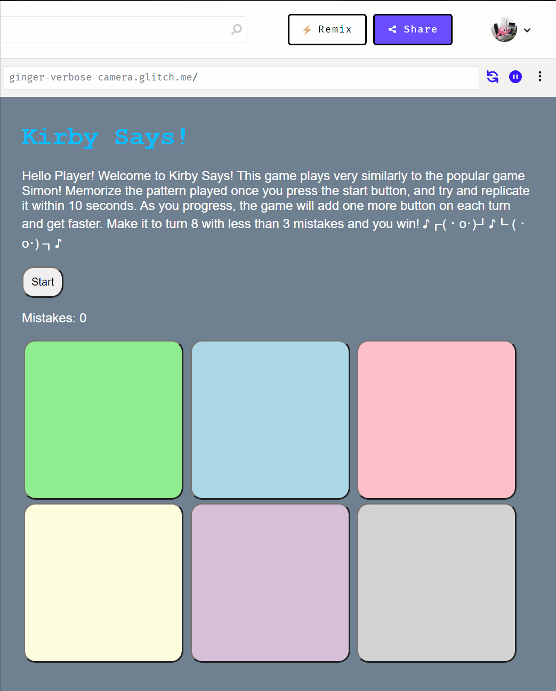
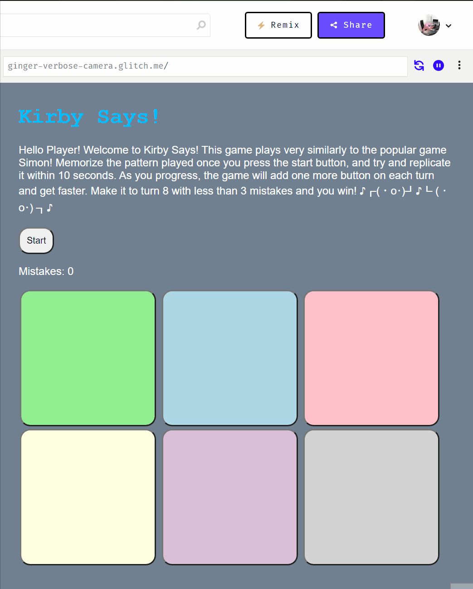
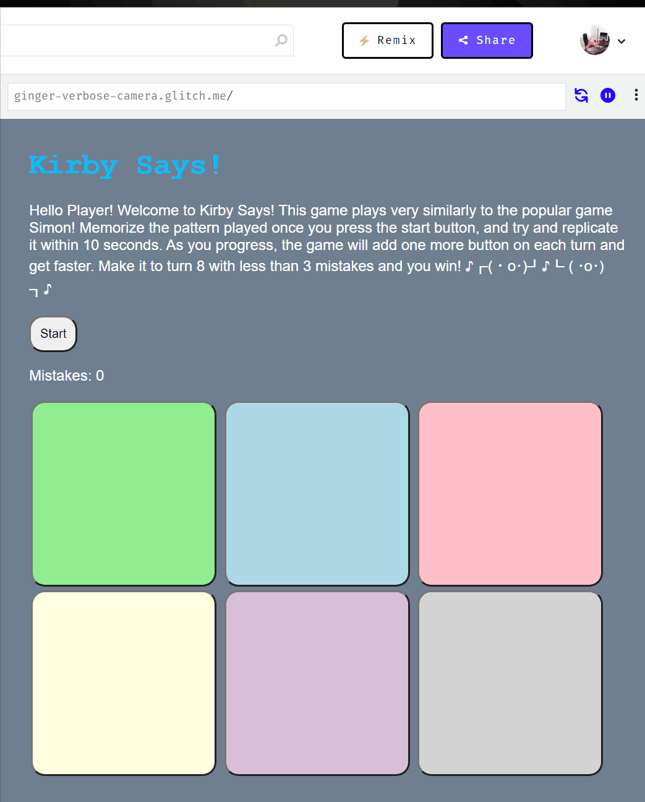

# Pre-work - *Memory Game*

**Memory Game** is a Light & Sound Memory game to apply for CodePath's Futureforce Tech Launchpad Program. 

Submitted by: **Kirby Ammari**

Time spent: **5** hours spent in total

Link to project: (https://glitch.com/edit/#!/ginger-verbose-camera?path=script.js%3A1%3A0)

## Required Functionality

The following **required** functionality is complete:

* [X] Game interface has a heading (h1 tag), a line of body text (p tag), and four buttons that match the demo app
* [X] "Start" button toggles between "Start" and "Stop" when clicked. 
* [X] Game buttons each light up and play a sound when clicked. 
* [X] Computer plays back sequence of clues including sound and visual cue for each button
* [X] Play progresses to the next turn (the user gets the next step in the pattern) after a correct guess. 
* [X] User wins the game after guessing a complete pattern
* [X] User loses the game after an incorrect guess

The following **optional** features are implemented:

* [X] Any HTML page elements (including game buttons) has been styled differently than in the tutorial
* [X] Buttons use a pitch (frequency) other than the ones in the tutorial
* [X] More than 4 functional game buttons
* [X] Playback speeds up on each turn
* [X] Computer picks a different pattern each time the game is played
* [X] Player only loses after 3 mistakes (instead of on the first mistake)
* [X] Game button appearance change goes beyond color (e.g. add an image)
* [ ] Game button sound is more complex than a single tone (e.g. an audio file, a chord, a sequence of multiple tones)
* [X] User has a limited amount of time to enter their guess on each turn

The following **additional** features are implemented:

- [X] When the user makes a mistake, it plays Homer Simpson "doh" sound

## Video Walkthrough (GIF)

If you recorded multiple GIFs for all the implemented features, you can add them here:

Note: For sake of space/length of video I reduced the pattern to 4 clues, however, the code should run with 8 clues.

Note: Shows players losing both ways (mistakes/time)

Note: Shows stopping mid sequence, also stops the timer.

## Reflection Questions
1. If you used any outside resources to help complete your submission (websites, books, people, etc) list them here. 
- https://www.tutorialrepublic.com/javascript-tutorial/javascript-timers.php
- https://www.myinstants.com/instant/doh/
- https://programminghead.com/how-to-play-audio-in-html-using-javascript/
- https://www.w3schools.com/jsref/met_win_clearinterval.asp
- https://www.w3schools.com/jsref/met_win_setinterval.asp\
- https://stackoverflow.com/questions/8683528/embed-image-in-a-button-element
- https://programminghead.com/how-to-play-audio-in-html-using-javascript/
- https://developer.mozilla.org/en-US/docs/Web/CSS/CSS_Backgrounds_and_Borders/Resizing_background_images
- https://sebhastian.com/display-javascript-variable-html/
- https://www.rapidtables.com/web/css/css-color.html

2. What was a challenge you encountered in creating this submission (be specific)? How did you overcome it?

    A challenge I encountered during this project was implementing the timer functionality. Much like the prework submission warns, this was definitely the most challenging aspect to implement. More specifically, finding the proper time and place to start and clear the interval was difficult. Much like many of the issues I run into when it comes to the timing/placing of a function, I use console log messages and a lot of test runs to fix the issue. In this case, I ran into an issue with needing to wait until after the sequence was finished to begin the countdown to stay consistent with the user having 10 seconds per turn after the sequence. To do this I first tried to set a constant amount of time to delay after the sequence ran, however, this is an issue due to the changing times of the sequence. After more debugging, I noticed that the delay variable adds the delays of the times for each clue together. Using that along with the setTimeout function, I was able to properly implement the timer. Finally, implementing the locations of the start and the clear interval was important to ensure I cleared the timer when it should be and vice versa. Again this took some playing with but after numerous console.log(“Here”) statements I was able to finish this task.

3. What questions about web development do you have after completing your submission?

    After completing this submission, I am very curious about the relationship between HTML and JavaScript. It is evident throughout the project that these two languages work very closely together. Unlike other languages I’ve used like Python, JavaScript looks to be very interesting not only with how it works with HTML but also the various third-party libraries that people have created to help web developers create incredible projects.
    
	Beyond the technical side of web development, I am also very excited to learn about team mechanics on group-based projects. I wonder greatly what makes a team environment run smoothly so that I can bring the same attitude, planning, etc. to any group or company I may work at. 
    
	Lastly, I am also very interested to see how each level of a full-stack project works and how they collaborate with one another to create the applications we see today. I am beyond thrilled to see how many great ideas can be crafted with web development and the resources available at tech companies.

4. If you had a few more hours to work on this project, what would you spend them doing (for example: refactoring certain functions, adding additional features, etc). Be specific.

    I think my first goal would be to clean up some of the code specifically with the timer. I placed numerous closeInterval() commands where I felt they were needed. And I feel like repeating that command multiple times may not be the most efficient, and I would like to see how to best reformat that in a cleaner way. 

	I would also want to customize the site more until I really liked the way it looked, and keep with a consistent theme. I definitely had a lot of fun working on this project and incorporating the programming languages mascot as the hidden image, but I think maintaining a theme would make everything look more complete.
    
	Once I like where my project is after cleaning up the existing code, I would want to implement additional features such as a score tally that maintains the number of games you’ve won, keeping the user more engaged beyond just one game. Along with that, I would want to allow the user to make their own customizations. For example, I would allow them to make the game harder or easier, changing the speed of the clues and length of the pattern accordingly. I think this would be a nice touch to really make a complete project.

## Interview Recording URL Link

[My 5-minute Interview Recording](https://www.youtube.com/watch?v=FTOxgBt-Zgs)

## License

    Copyright [Kirby Ammari]

    Licensed under the Apache License, Version 2.0 (the "License");
    you may not use this file except in compliance with the License.
    You may obtain a copy of the License at

        http://www.apache.org/licenses/LICENSE-2.0

    Unless required by applicable law or agreed to in writing, software
    distributed under the License is distributed on an "AS IS" BASIS,
    WITHOUT WARRANTIES OR CONDITIONS OF ANY KIND, either express or implied.
    See the License for the specific language governing permissions and
    limitations under the License.
